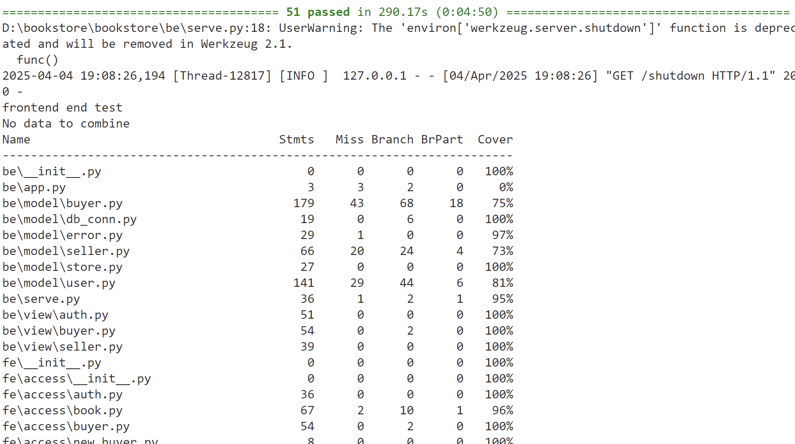
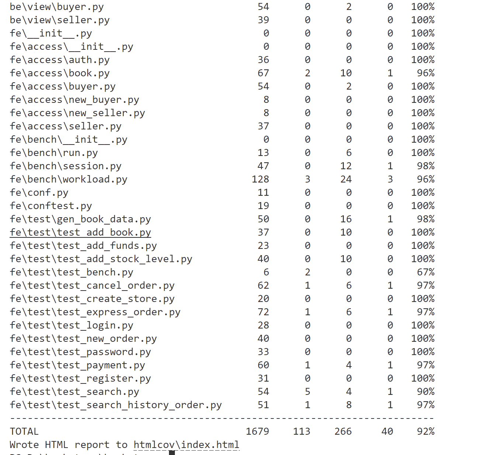

# 第一次大作业：书店  实验报告

### 小组成员与分工

| 学号        | 姓名   | 分工                                          |
| :---------- | ------ | --------------------------------------------- |
| 10235101465 | 曲正博 | 卖家用户权限接口，共同完成后40%功能，实验报告撰写 |
| 10235101467 | 陈灏   | 买家用户权限接口，共同完成后40%功能，实验报告撰写 |

## 1. 功能
本项目实现了一个提供网上购书功能的网站后端，主要功能包括：
- 支持书商在网站上开设店铺。
- 支持购买者通过网站购买书籍。
- 支持买家和卖家注册自己的账号。
- 每个卖家可以开设一个或多个网上商店。
- 支持买家为自己的账户充值，并在任意商店购买图书。
- 支持完整的购物流程：下单 -> 付款 -> 发货 -> 收货。<br>

**1.1 基础功能（60%）<br>**

根据项目文档中的 .md 文件描述，实现以下接口功能并确保所有测试用例通过：

1)用户权限接口：注册、登录、登出、注销等基础功能。<br>

2)买家用户接口：充值、下单、付款等功能。<br>

3)卖家用户接口：创建店铺、添加书籍信息及描述、增加库存等功能。<br>


**1.2 扩展功能（40%）<br>**

1)发货与收货流程： <br>

- 完成订单从“已付款”到“已发货”再到“已收货”的状态流转。

2)图书搜索功能： <br>

- 支持关键字搜索，包括题目、内容、标签、商店ID，页码
- 支持全站搜索或当前店铺搜索。
- 结果分页显示，优化查询性能。

3)订单管理：<br>

- 用户可查询自己的历史订单。<br>
- 用户可主动取消订单。 <br>
- 系统支持超时未付款订单的自动取消。<br>


## 2. bookstore目录结构
```
bookstore
  |-- be                            # 后端代码
        |-- model                     # 后端逻辑代码
        |-- view                      # 访问后端接口
        |-- ....
  |-- doc                           # JSON API规范说明
  |-- fe                            # 前端访问与测试代码
        |-- access                    # 前端接口调用
        |-- bench                     # 效率测试
        |-- data                    
            |-- book.db               # 图书数据文件
            |-- scraper.py            # 爬取图书信息脚本
        |-- test                      # 功能性测试
        |-- conf.py                   # 测试参数配置文件
        |-- conftest.py               # pytest初始化配置文件
        |-- ....
  |-- ....
```


## 3. 基础功能实现(60%)

### 3.0 思路实现

将 SQLite 框架中的 SQL 语言修改为 MongoDB 语言。


此外，在 `fe/access/book.py` 中完成对 MongoDB 数据库的连接：

```python
def __init__(self, large: bool = False):
    db_path = "mongodb://localhost:27017"
    db_name = "bookstore"
    self.client = pymongo.MongoClient(db_path)
    self.db = self.client[db_name]
```

在 `be/model/store.py` 中进行数据库连接并初始化表格信息：

```python
def __init__(self):
    self.client = pymongo.MongoClient("localhost", 27017)
    self.database = self.client["bookstore"]
    self.init_tables()

def init_tables(self):
    conn = self.get_db_conn()
    user_table = conn["user"]
    user_store_table = conn["user_store"]
    store_table = conn["store"]
    new_order_table = conn["new_order"]
    new_order_detail_table = conn["new_order_detail"]
```


### 3.1 用户权限接口

##### 3.1.1 注册

在 `be/model/user.py` 中实现 `register()` 函数

```python
def register(self, user_id: str, password: str):
    if self.user_id_exist(user_id):
        return error.error_exist_user_id(user_id)
    try:
        terminal = f"terminal_{time.time()}"
        token = jwt_encode(user_id, terminal)
        user_key = {
            "user_id": user_id,
            "password": password,
            "balance": 0,
            "token": token,
            "terminal": terminal,
        }
        self.conn['user'].insert_one(user_key)
    except pymongo.errors.PyMongoError as e:
        return 528, str(e)
    return 200, "ok"
```

##### 3.1.2 登录

在 `be/model/user.py` 中实现 `login()` 函数：

```python
def login(self, user_id: str, password: str, terminal: str):
    try:
        code, message = self.check_password(user_id, password)
        if code != 200:
            return code, message, ""
        
        token = jwt_encode(user_id, terminal)
        cursor = self.conn['user'].update_one(
            {'user_id': user_id}, 
            {'$set': {'token': token, 'terminal': terminal}}
        )
        if cursor.matched_count == 0:
            return error.error_authorization_fail() + ("",)
    except pymongo.errors.PyMongoError as e:
        return 528, str(e), ""
    return 200, "ok", token
```

##### 3.1.3 登出

在 `be/model/user.py` 中实现 `logout()` 函数：

```python
def logout(self, user_id: str, token: str):
    try:
        code, message = self.check_token(user_id, token)
        if code != 200:
            return code, message
        
        terminal = f"terminal_{time.time()}"
        dummy_token = jwt_encode(user_id, terminal)
        cursor = self.conn['user'].update_one(
            {'user_id': user_id}, 
            {'$set': {'token': dummy_token, 'terminal': terminal}}
        )
        if cursor.matched_count == 0:
            return error.error_authorization_fail()
    except pymongo.errors.PyMongoError as e:
        return 528, str(e)
    return 200, "ok"
```

##### 3.1.4 注销

在 `be/model/user.py` 中实现 `unregister()` 函数：

```python
 	try:
            code, message = self.check_password(user_id, password)
            if code != 200:
                return code, message

            cursor = self.conn['user'].delete_one({"user_id": user_id})
            if cursor.deleted_count != 1:
                return error.error_authorization_fail()
```

##### 3.1.5修改密码

在 `be/model/user.py` 中实现 `change_password()` 函数：

```python
def change_password(self, user_id: str, old_password: str, new_password: str):
    try:
        code, message = self.check_password(user_id, old_password)
        if code != 200:
            return code, message
        
        terminal = f"terminal_{time.time()}"
        token = jwt_encode(user_id, terminal)
        cursor = self.conn['user'].update_one(
            {'user_id': user_id},
            {'$set': {'password': new_password, 'token': token, 'terminal': terminal}}
        )
        if cursor.matched_count == 0:
            return error.error_authorization_fail()
    except pymongo.errors.PyMongoError as e:
        return 528, str(e)
    return 200, "ok"
```

### 3.2 买家用户接口

##### 3.2.1 充值

在 `be/model/buyer.py` 中实现 `add_funds()` 函数：

```python
def add_funds(self, user_id: str, password: str, add_value: float):
    try:
        user = self.conn["user"].find_one({"user_id": user_id})
        if not user or user["password"] != password:
            return error.error_authorization_fail()
        
        result = self.conn["user"].update_one(
            {"user_id": user_id},
            {"$inc": {"balance": add_value}}
        )
        if result.modified_count == 0:
            return error.error_non_exist_user_id(user_id)
    except pymongo.errors.PyMongoError as e:
        return 528, str(e)
    return 200, "ok"
```

##### 3.2.2 下单

在 `be/model/buyer.py` 中实现 `new_order()` 函数：

```python
def new_order(self, user_id: str, store_id: str, id_and_count: list):
    try:
        if not self.user_id_exist(user_id) or not self.store_id_exist(store_id):
            return error.error_invalid_user_or_store_id(user_id, store_id)
        
        order_id = f"{user_id}_{store_id}_{uuid.uuid1()}"
        order_details = []
        
        for book_id, count in id_and_count:
            book = self.conn["store"].find_one({"store_id": store_id, "book_id": book_id})
            if not book or book["stock_level"] < count:
                return error.error_stock_level_low(book_id)
            
            self.conn["store"].update_one(
                {"store_id": store_id, "book_id": book_id},
                {"$inc": {"stock_level": -count}}
            )
            
            book_info = json.loads(book["book_info"])
            price = book_info.get("price")
            order_detail = {
                "order_id": order_id,
                "book_id": book_id,
                "count": count,
                "price": price
            }
            order_details.append(order_detail)
        
        self.conn["new_order"].insert_one({
            "order_id": order_id,
            "user_id": user_id,
            "store_id": store_id
        })
        self.conn["new_order_detail"].insert_many(order_details)
    except pymongo.errors.PyMongoError as e:
        return 528, str(e)
    return 200, "ok", order_id
```

##### 3.2.3 付款

在 `be/model/buyer.py` 中实现 `payment()` 函数：

```python
def payment(self, user_id: str, password: str, order_id: str):
    try:
        order = self.conn["new_order"].find_one({"order_id": order_id})
        if not order or order["user_id"] != user_id:
            return error.error_invalid_order_id(order_id)
        
        buyer = self.conn["user"].find_one({"user_id": user_id})
        if not buyer or buyer["password"] != password:
            return error.error_authorization_fail()
        
        seller = self.conn["user_store"].find_one({"store_id": order["store_id"]})
        if not seller:
            return error.error_non_exist_store_id(order["store_id"])
        
        total_price = sum(
            detail["price"] * detail["count"]
            for detail in self.conn["new_order_detail"].find({"order_id": order_id})
        )
        if buyer["balance"] < total_price:
            return error.error_not_sufficient_funds(order_id)
        
        self.conn["user"].update_one(
            {"user_id": user_id},
            {"$inc": {"balance": -total_price}}
        )
        self.conn["user"].update_one(
            {"user_id": seller["user_id"]},
            {"$inc": {"balance": total_price}}
        )
        self.conn["new_order"].delete_one({"order_id": order_id})
        self.conn["new_order_detail"].delete_many({"order_id": order_id})
    except pymongo.errors.PyMongoError as e:
        return 528, str(e)
    return 200, "ok"
```

### 3.3 卖家用户接口

##### 3.3.1 创建店铺

在 `be/model/seller.py` 中实现 `create_store()` 函数：

```python
def create_store(self, user_id: str, store_id: str):
    try:
        if not self.user_id_exist(user_id) or self.store_id_exist(store_id):
            return error.error_invalid_user_or_store_id(user_id, store_id)
        
        self.conn["user_store"].insert_one({
            "user_id": user_id,
            "store_id": store_id
        })
    except pymongo.errors.PyMongoError as e:
        return 528, str(e)
    return 200, "ok"
```

##### 3.3.2 添加书籍

在 `be/model/seller.py` 中实现 `add_book()` 函数：

```python
def add_book(self, user_id: str, store_id: str, book_id: str, book_info: dict, stock_level: int):
    try:
        if not self.user_id_exist(user_id) or not self.store_id_exist(store_id) or self.book_id_exist(store_id, book_id):
            return error.error_invalid_user_or_store_id(user_id, store_id)
        
        self.conn["store"].insert_one({
            "store_id": store_id,
            "book_id": book_id,
            "book_info": json.dumps(book_info),
            "stock_level": stock_level
        })
    except pymongo.errors.PyMongoError as e:
        return 528, str(e)
    return 200, "ok"
```

##### 3.3.3 增加库存

在 `be/model/seller.py` 中实现 `add_stock_level()` 函数：

```python
def add_stock_level(self, user_id: str, store_id: str, book_id: str, add_stock_level: int):
    try:
        if not self.user_id_exist(user_id) or not self.store_id_exist(store_id) or not self.book_id_exist(store_id, book_id):
            return error.error_invalid_user_or_store_id(user_id, store_id)
        
        self.conn["store"].update_one(
            {"store_id": store_id, "book_id": book_id},
            {"$inc": {"stock_level": add_stock_level}}
        )
    except pymongo.errors.PyMongoError as e:
        return 528, str(e)
    return 200, "ok"
```

## 4. 扩展功能(40%)
#### 4.1 发货与收货

在 `be/model/buyer.py` 和 `be/model/seller.py` 中分别实现发货和收货功能：


```python
def express_order(self, store_id: str, order_id: str) -> int:
    json_data = {
        "user_id": self.seller_id,
        "store_id": store_id,
        "order_id": order_id,
    }
    url = urljoin(self.url_prefix, "express_order")
    headers = {"token": self.token}
    response = requests.post(url, headers=headers, json=json_data)
    return response.status_code
```

```python
def receive_order(self, order_id: str) -> int:
    json_data = {
        "user_id": self.user_id,
        "order_id": order_id,
    }
    url = urljoin(self.url_prefix, "receive_order")
    headers = {"token": self.token}
    response = requests.post(url, headers=headers, json=json_data)
    return response.status_code
```

#### 4.2 图书搜索

在 `be/model/store.py` 中实现 `search_book()` 函数：
```python
def search_book(self, title: str = None, content: str = None, tag: str = None, store_id: str = None, page: int = 1):
    query = {}
    if title:
        query['title'] = {"$regex": title}
    if content:
        query['content'] = {"$regex": content}
    if tag:
        query['tags'] = {"$regex": tag}
    if store_id:
        store_query = {"store_id": store_id}
        store_result = list(self.conn["store"].find(store_query))
        if not store_result:
            return error.error_non_exist_store_id(store_id)
        book_ids = [item["book_id"] for item in store_result]
        query['id'] = {"$in": book_ids}
    
    per_page = 10
    skip = (page - 1) * per_page
    results = list(self.conn["books"].find(query).skip(skip).limit(per_page))
    return 200, "ok", results
```

#### 4.3 查询历史订单

在 `be/model/buyer.py` 中实现 `search_history_order()` 函数：

```python
history_orders = self.conn["order_history"].find({"user_id": user_id})
if not list(history_orders):
    return error.error_non_exist_user_id(user_id) + ([],)

results = []
for order in history_orders:
    order_id = order["order_id"]
    details = self.conn["order_history_detail"].find({"order_id": order_id})
    detail_list = []
    for detail in details:
        book_id = detail["book_id"]
        count = detail["count"]
        price = detail["price"]
        status = order["status"]
        order_detail = {
            "book_id": book_id,
            "count": count,
            "price": price,
            "status": status
        }
        detail_list.append(order_detail)

    result = {
        "order_id": order_id,
        "details": detail_list
    }
    results.append(result)
```

#### 4.4 取消订单

##### 4.4.1 手动取消订单

在 `be/model/buyer.py` 中添加手动取消订单的 `cancel_order()` 函数：

```python
			result = self.conn["new_order"].delete_one({"order_id": order_id})
            if result.deleted_count == 0:
                return error.error_invalid_order_id(order_id)

            result = self.conn["new_order_detail"].delete_many({"order_id": order_id})
            result = self.conn["order_history"].update_one(
                {"order_id": order_id},
                {"$set": {"status": "cancelled"}}
            )
            if result.modified_count == 0:
                return error.error_invalid_order_id(order_id)
```


##### 4.4.2 自动取消订单

此功能需要`import time`

在`be/model`下的`buyer.py`中的`new_order()`函数添加一段代码：

```python
			timer = threading.Timer(30,self.cancel_order,args=[user_id, order_id])
            timer.start()
```

在创建新订单，新订单表中更新信息完成后，设定一个定时器，定时器超时后代表订单失效，自动取消，调用`cancel_order()`函数。使用到的函数时`threading.Timer(interval, function, args=[], kwargs={})`,代表超出时间间隔`interval`后执行`function`,参数为`args`[],`kwargs{}`。令时间间隔为30秒。

对应的测试程序为`fe/test`下的`test_cancel_order.py`，调用`time.sleep(interval)`令其睡眠一定时间使订单超时，测试其是否能够自动取消订单。

#### 测试结果


## 5. 亮点

#### 5.1 索引

为了提升数据查询效率，我们在项目中引入了索引机制。以下是索引的主要作用和实现方式：<br>

优点：

1. 保证唯一性：通过为某些字段创建索引，可以确保这些字段的值在集合中是唯一的。

2. 加快检索速度：索引能够显著减少查询操作的时间复杂度，特别是在处理大规模数据时效果明显。

3. 优化排序与分组：为需要频繁排序或分组的字段添加索引，可以加速这些操作的执行。

实现细节:
- 用户表 (`user`)：`user_id` 是用户的唯一标识符，因此为其创建了单字段索引。
- 用户店铺关联表 (`user_store`)：`[user_id, store_id] `组合键用于快速查找某个用户开设的所有店铺。
- 库存表 (`store`)：`[book_id, store_id] `组合键用于高效定位特定店铺中的书籍信息。
- 书籍表 (`books`)：`id` 字段作为书籍的唯一标识符，且该表内容相对固定，因此也为其创建了索引。
```python
def init_tables(self):
    self.database["user"].create_index([("user_id", pymongo.ASCENDING)])  # 用户表索引
    self.database["user_store"].create_index([("user_id", pymongo.ASCENDING), ("store_id", pymongo.ASCENDING)])  # 用户店铺关联表索引
    self.database["store"].create_index([("book_id", pymongo.ASCENDING), ("store_id", pymongo.ASCENDING)])  # 库存表索引
```

此外，在前端访问层 (`fe/access/store.py`) 中，我们也为书籍表的 `id` 字段创建了索引：

```python
def __init__(self, large: bool = False):
    db_path = "mongodb://localhost:27017"
    db_name = "bookstore"
    self.client = pymongo.MongoClient(db_path)
    self.db = self.client[db_name]
    self.db.books.create_index([("id", pymongo.ASCENDING)])  # 书籍表索引
```

缺点：

1. 存储开销：索引会占用额外的磁盘空间，随着数据量的增长，这种开销可能会变得显著。

2. 写入性能下降：每次插入、更新或删除数据时，都需要同步维护索引，这会导致写操作的性能有所降低。

通过权衡索引的优缺点，我们仅在高频查询的字段上创建索引，从而在性能和资源消耗之间找到平衡点。

#### 5.2  git 

以下是本次实验项目的github仓库链接:
https://github.com/Haooooc/Database-course

git提交记录：
